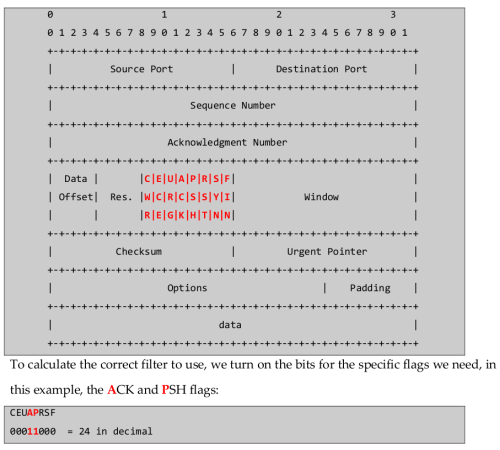

# Reading and Filtering

## Read packets from file

`tcpdump -­r password_cracking_filtered.pcap`

## Cut only IP addresses from the traffic

`tcpdump -­r password_cracking_filtered.pcap  | awk-­‐F" " '{print $3}' | sort -­‐u | head`

## Filter by source

`tcpdump -n src host <ip> -­r password_cracking_filtered.pcap`

## Filter by destination

`tcpdump -n dst host <ip> ‐r password_cracking_filtered.pcap`

## Filter by port

`tcpdump -n port <port> -­r password_cracking_filtered.pcap`

## Advanced header filtering

`tcpdump -A -n 'tcp[13] = 24' -­‐r password_cracking_filtered.pcap`

## Important flags

* `-nn` stop DNS and service names lookup (performance+)
* `-X` print in hex and ascii without link level headers
* `-XX` print in hex and ascii with link level headers
* `-A` print packets in ASCII
* `-S` to print absolute sequence numbers
* `-s` increase the default snap-length from 262144 to higher
* `-s 0` to capture full packet
